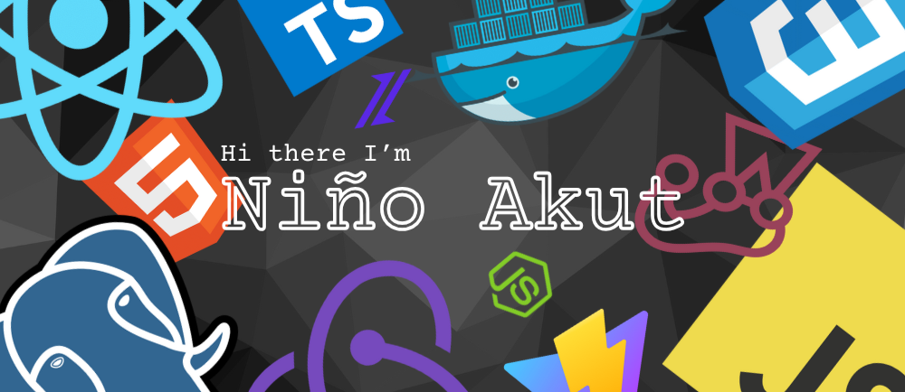

## A Passionate ReactJS Web Developer👋

- 🔭 I’m planning to become a **Full-Stack Developer ReactJS Web Developer**
- 🌱 I’m currently learning **Test-Driven Development (TDD)**
- 🤔 I'm interested in everything **Microservices**
- ⚙️ I use daily: `.html`, `.css`, `.jsx`, `.tsx`, `.scss`, `.svg`
- 📫 How to reach me: **[Gmail](mailto:akutnino@gmail.com),
  [LinkedIn](https://www.linkedin.com/in/ghazi-khan/), [Facebook](https://www.facebook.com/akutnino/)**

## Tech Stack 📚

---

<!--
**akutnino/akutnino** is a ✨ _special_ ✨ repository because its `README.md` (this file) appears on your GitHub profile.

Here are some ideas to get you started:

- 🔭 I’m currently working on ...
- 🌱 I’m currently learning ...
- 👯 I’m looking to collaborate on ...
- 🤔 I’m looking for help with ...
- 💬 Ask me about ...
- 📫 How to reach me: ...
- 😄 Pronouns: ...
- ⚡ Fun fact: ...
  -->
